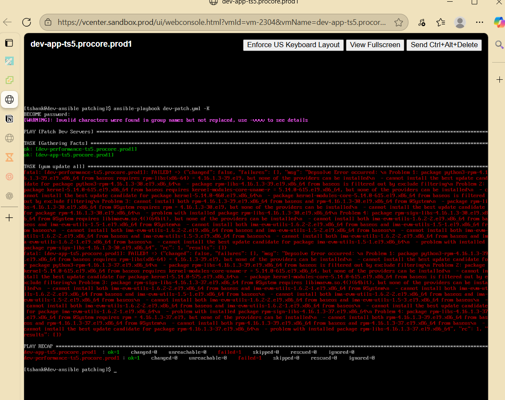

# TS5-17 – Patch Dev Servers Using Ansible

## Summary
Patched multiple development Linux servers using an Ansible playbook to automate package updates while excluding critical system packages. Identified and resolved RPM dependency conflicts encountered during execution, ensuring systems were updated safely without service disruption.

---

## Environment
- OS: RHEL/CentOS-based Linux
- Automation Tool: Ansible
- Package Manager: DNF/YUM
- Inventory Group: dev-ts5
- Privilege Escalation: sudo
- Servers:
  - dev-app-ts5.procore.prod1
  - dev-performance-ts5.procore.prod1

---

## Requirements
- Patch all development servers using automation
- Exclude kernel and core system packages from updates
- Handle dependency conflicts gracefully
- Validate successful updates on all target hosts
- Ensure playbook can be rerun safely (idempotent behavior)

---

## Approach
1. Reviewed the provided Ansible playbook template and copied it before modification to preserve the original.
2. Defined the correct host group in the inventory for development servers.
3. Configured the playbook to:
   - Use `dnf` for updates
   - Exclude kernel and RPM-related packages
   - Skip broken dependencies
   - Use `update_only` to prevent unintended package installation
4. Executed the playbook using privilege escalation.
5. Analyzed failure output to identify dependency issues.
6. Applied corrective actions and reran the playbook.

---

## Troubleshooting
During the initial execution, the playbook failed due to RPM dependency conflicts involving:
- `python3-rpm`
- `rpm-libs`
- `kernel-modules-core`
- `ima-evm-utils`

### Resolution Steps
- Reviewed Ansible error output and DNF dependency messages.
- Identified conflicts caused by version constraints between installed packages and available updates.
- Adjusted update behavior to allow compatible package versions to be selected.
- Reran the playbook after clearing DNF cache.
- Confirmed that all hosts completed successfully with no failed tasks.

---

## Validation
- Ansible play recap showed successful execution on all hosts.
- No unreachable or failed hosts reported.
- Updated packages confirmed via DNF output.
- Playbook completed with idempotent behavior on subsequent runs.

---

## Screenshots

### Ansible Playbook for Automated Dev Server Patching

### Initial Patch Failure (Dependency Conflict)

### Inventory Misconfiguration Causing Hosts to Be Skipped

### Successful Package Updates After Dependency Resolution

### Successful Ansible Playbook Execution

---

## What I Learned
- How to use Ansible to automate patching across multiple Linux systems
- How to interpret and troubleshoot RPM and DNF dependency conflicts
- Importance of excluding kernel updates during routine patching
- Best practices for modifying automation templates in enterprise environments
- Value of idempotent automation for safe, repeatable operations
