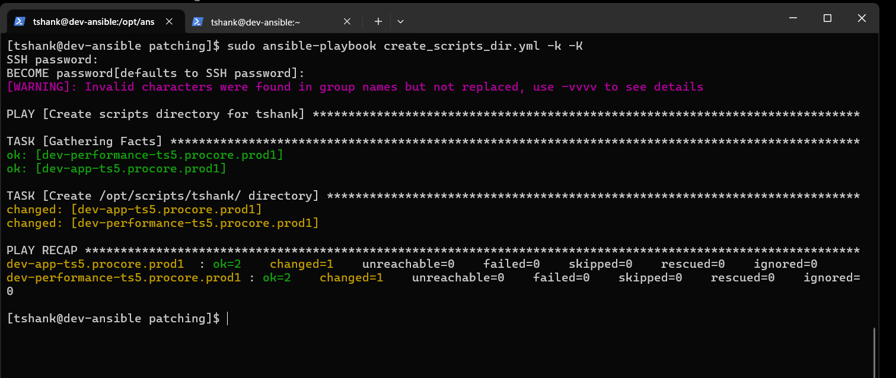
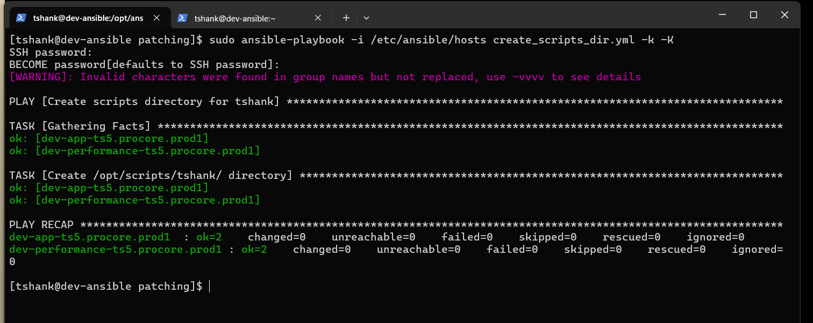
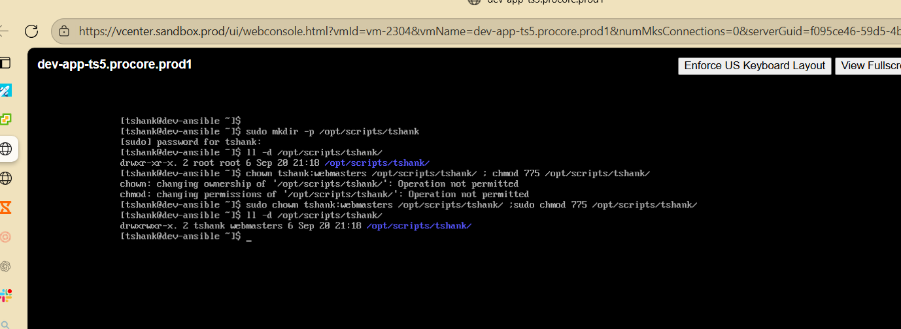

# TS5-18 – Create Shared Scripts Directory Using Ansible

## Summary
Automated the creation of a shared scripts directory across multiple development servers using Ansible. Ensured the directory was created with correct ownership, group permissions, and access rights to support collaboration within the webmasters team.

---

## Environment
- OS: RHEL/CentOS-based Linux
- Automation Tool: Ansible
- Control Node: dev-ansible
- Target Hosts:
  - dev-app-ts5.procore.prod1
  - dev-performance-ts5.procore.prod1
- Directory Path: /opt/scripts/{{ ansible_user }}/
- User: tshank
- Group: webmasters
- Permissions: 775

---

## Requirements
- Create `/opt/scripts/{username}/` on all development servers
- Directory must be:
  - Owned by the user
  - Assigned to the `webmasters` group
  - Set with permissions `775`
- Automation must run from Ansible control node
- Changes must apply to **multiple hosts**, not locally

---

## Approach
1. Created an Ansible playbook using the `file` module to manage directory creation.
2. Parameterized the directory path using `{{ ansible_user }}` to ensure portability.
3. Set:
   - `state: directory`
   - `owner: {{ ansible_user }}`
   - `group: webmasters`
   - `mode: 0775`
4. Executed the playbook with privilege escalation.
5. Identified execution issues related to inventory targeting.
6. Corrected the command to explicitly reference the Ansible inventory file.
7. Re-ran the playbook and verified results on all target hosts.

---

## Troubleshooting
### Issue 1: Directory Created on Control Node Only
- Initial execution ran without specifying inventory.
- Resulted in changes applying locally instead of target hosts.

**Resolution**
- Re-ran the playbook using:
ansible-playbook -i /etc/ansible/hosts create_scripts_dir.yml -k -K

### Issue 2: Permission Errors During Manual Testing
- Attempted ownership and permission changes manually before automation.
- Encountered permission denied errors without elevated privileges.

**Resolution**
- Ensured `become: yes` was set in the playbook.
- Allowed Ansible to manage permissions declaratively.

---

## Validation
- Play recap confirmed successful execution on both hosts.
- Directory exists on:
- dev-app-ts5.procore.prod1
- dev-performance-ts5.procore.prod1
- Ownership verified:
- User: tshank
- Group: webmasters
- Permissions verified as `drwxrwxr-x (775)`

---

## Screenshots

### Ansible Playbook for Directory Creation

### Initial Playbook Run Without Inventory

### Successful Playbook Execution on Multiple Hosts

### Directory Created with Correct Ownership and Permissions

---

## What I Learned
- How to use the Ansible `file` module for consistent filesystem management
- Importance of explicitly specifying inventory when running playbooks
- How to safely manage ownership and permissions across multiple systems
- Value of parameterization using Ansible variables
- Why automation is preferred over manual configuration in shared environments
