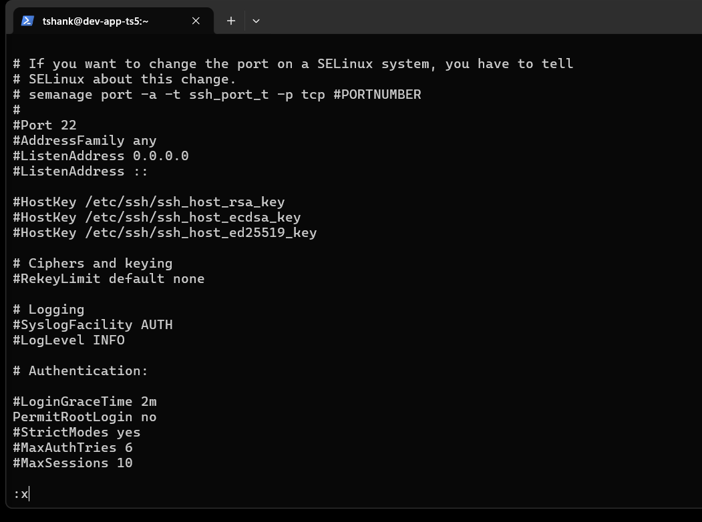
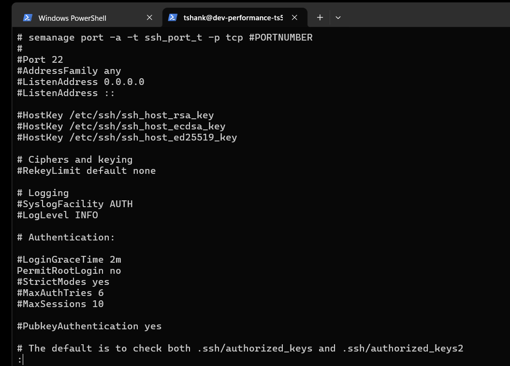
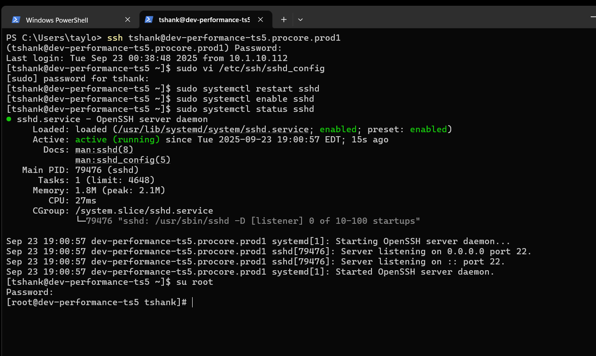
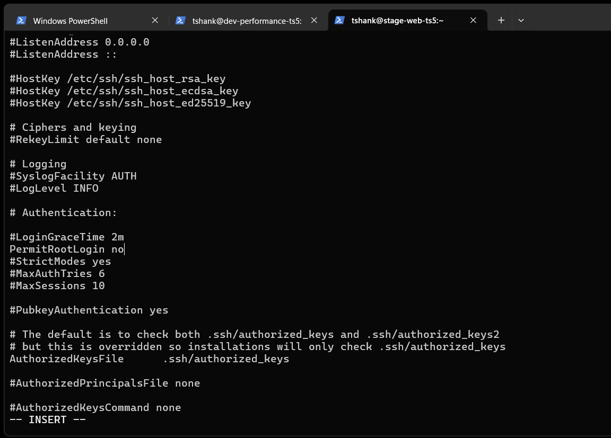

# TS5-24 – Disable and Prevent SSH Root User Access

## 📌 Ticket Overview
As part of the security audit requirements, SSH root login was disabled across all servers to reduce attack surface and enforce least-privilege access. Root access via SSH was explicitly disabled in the SSH daemon configuration, and services were restarted to apply changes.

---

## 🎯 Objective
- Disable SSH root login on all servers
- Ensure configuration persists after service restart
- Verify SSH service status after changes

---

## 🛠️ Actions Performed

- Updated `/etc/ssh/sshd_config` to disable root login
- Restarted SSH daemon to apply configuration changes
- Verified SSH service status on each server

---

## 🖥️ Servers Affected
- `dev-app`
- `dev-performance`
- `stage-web`

---

## 📸 Screenshots

### 1. Disable Root Login – dev-app

---

### 2. SSHD Service Status – dev-app

---

### 3. Disable Root Login – dev-performance

---

### 4. SSHD Service Status – dev-performance

---

### 5. Disable Root Login – stage-web

---

### 6. SSHD Service Status – stage-web

---

## ✅ Outcome
- SSH root login successfully disabled on all servers
- SSH service running and verified post-configuration
- Security posture improved by enforcing non-root access

---

## 🔐 Security Impact
Disabling root SSH access mitigates brute-force attacks against privileged accounts and enforces secure access practices aligned with enterprise security standards.

---

## 🧰 Tools & Technologies
- OpenSSH
- Linux (RHEL-based systems)
- Systemd
