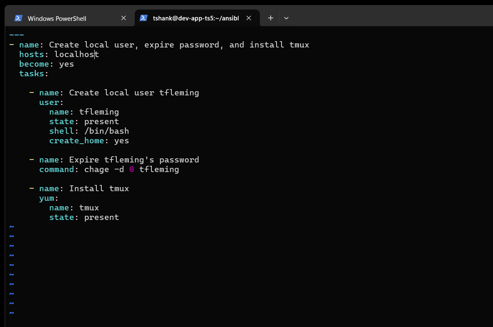
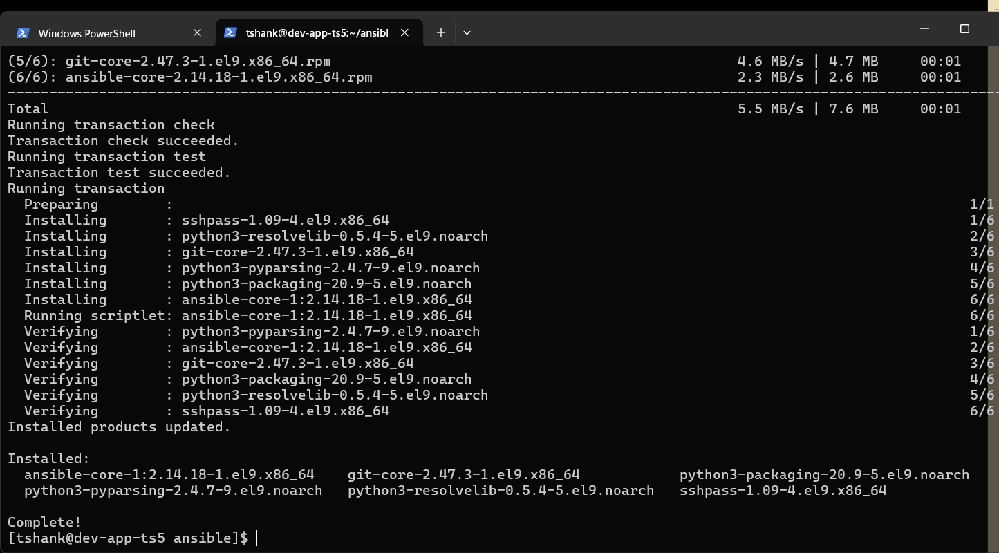
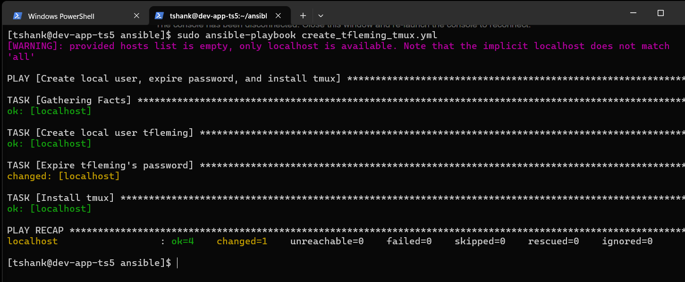

# TS5-50 — Create Tasks Using Ansible Playbook

## Overview
This ticket required creating an Ansible playbook to automate basic system administration tasks on a development application server.

The playbook was designed to:
- Create a local user
- Expire the user's password
- Install a required system utility

---

## Requirements
- Target VM: `dev-app-[initials].procore.prod1`
- Ansible playbook must:
  - Create local user `tfleming`
  - Expire `tfleming`'s password
  - Install `tmux`

---

## Implementation Details

An Ansible playbook was created with the following tasks:
- **User Management:** Created local user `tfleming` with a home directory and default shell
- **Security Enforcement:** Expired the user's password to require reset on first login
- **Package Management:** Installed `tmux` using the system package manager

The playbook was executed locally on the target VM after ensuring Ansible was installed and dependencies were resolved.

---

## Challenges & Resolution

### Issue
Ansible was not initially installed on the `dev-app` server, and package installation failed due to repository conflicts.

### Resolution
- Disabled conflicting Red Hat repositories
- Installed required Ansible dependencies
- Re-ran the playbook successfully after repository correction

---

## Validation
- User `tfleming` successfully created
- Password expiration confirmed
- `tmux` package installed
- Playbook completed with no failures

---

## Screenshots

---

## What I Learned
- Writing idempotent Ansible tasks for user and package management
- Troubleshooting Ansible installation issues related to repository configuration
- Validating automation success through play recap output
