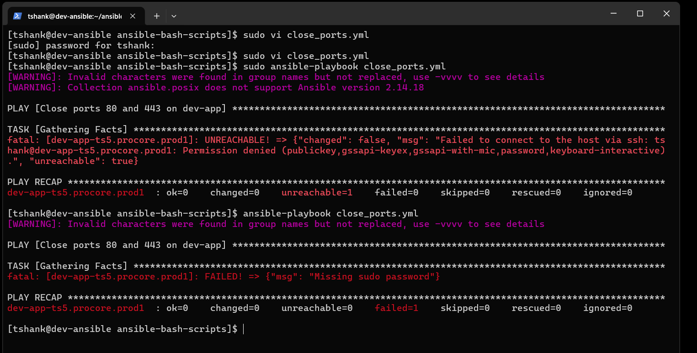
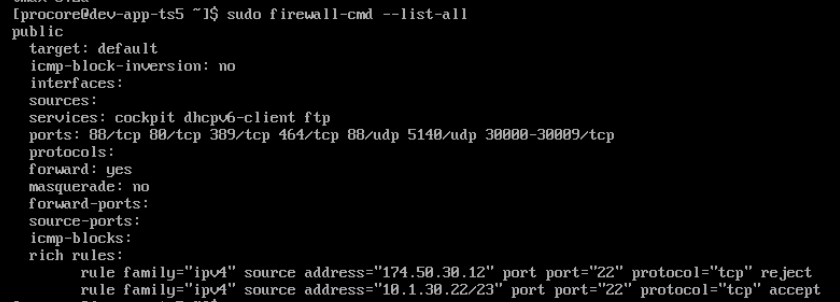

# TS5-51 – Close Ports 80 and 443 Using Ansible

## Overview
This ticket documents using an Ansible playbook to harden a Linux system by closing HTTP (port 80) and HTTPS (port 443) using `firewalld` on a development application server.

---

## Tasks Performed
1. Identified the target host in the Ansible inventory (`dev-app-ts5.procore.prod1`)
2. Created an Ansible playbook to manage firewall configuration
3. Ensured `firewalld` package was installed
4. Enabled and started the `firewalld` service
5. Removed HTTP (port 80) service from the firewall
6. Removed HTTPS (port 443) service from the firewall
7. Reloaded firewall rules to apply changes
8. Troubleshot Ansible execution errors related to module resolution and privilege escalation
9. Re-ran the playbook successfully with proper flags

---

## Validation
- Playbook executed successfully without failures
- Firewall rules were applied immediately and permanently
- `firewall-cmd --list-all` confirmed ports 80 and 443 were no longer allowed
- Play recap showed tasks completed with expected `ok` and `changed` states

---

## Screenshots
- **Ansible Inventory Configuration** – Target host definition used for the playbook
  
- **Firewall Hardening Playbook** – Ansible playbook used to close ports 80 and 443

- **Initial Module Resolution Error** – Error encountered when `ansible.posix.firewalld` module was not resolved
 
- **Privilege Escalation Error** – Failure caused by missing sudo credentials

- **Successful Playbook Execution** – Playbook run with correct privilege escalation flags

- **Firewall Rule Verification** – Output confirming ports 80 and 443 are closed

---

## What I Learned
- How to automate firewall rule management using Ansible
- Importance of privilege escalation when modifying system-level services
- How to troubleshoot Ansible module and execution errors
- Best practices for applying and validating firewall hardening changes
