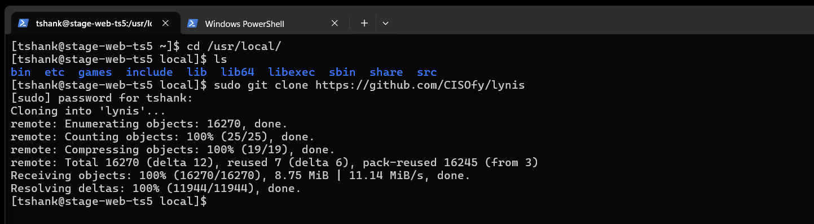
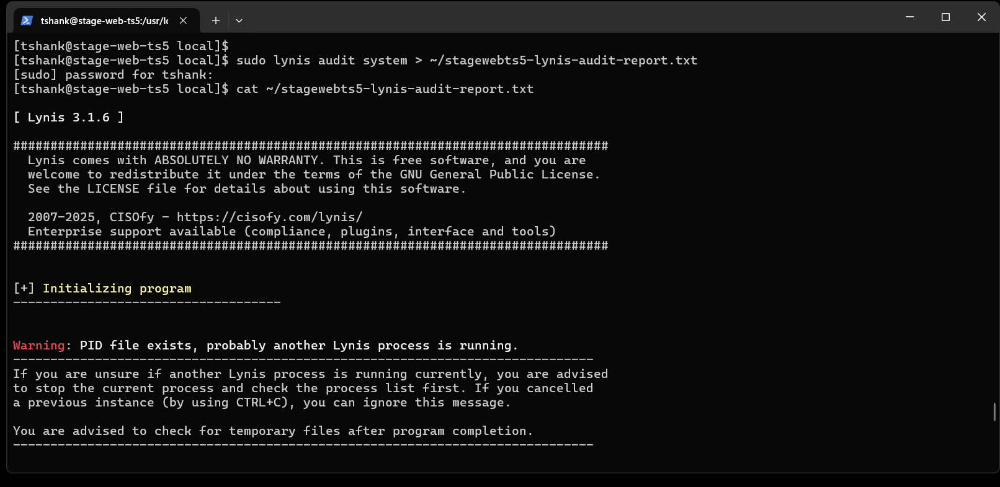

# TS5-80 – Perform a Security Audit on a Linux System Using Lynis

## Overview
This task involved performing a security audit on a Linux system using **Lynis**, a security auditing tool used by system administrators and security professionals. The audit was executed on the **stage-web** server, and the results were redirected to a file for review and documentation.

---

## Objectives
- Install Lynis on the stage-web server
- Run a full system security audit
- Redirect audit output to a file
- Document results with screenshots for verification

---

## Environment
- **Server:** stage-web
- **OS:** RHEL / Rocky Linux (Enterprise Linux)
- **Tool:** Lynis

---

## Implementation Steps

1. Installed Lynis on the stage-web server
2. Executed a Lynis system security audit
3. Redirected audit output to a local file
4. Reviewed audit results for security recommendations

---

## Validation
- Lynis successfully installed
- Audit completed without interruption
- Audit output successfully redirected to a file
- Results available for review and submission

---

## Screenshots

### 1. Lynis Installed on stage-web

---

### 2. Lynis Audit Executed

---

### 3. Lynis Audit Output Redirected to File

---

## What I Learned
- How to perform a security audit using Lynis
- Importance of routine security scans on production systems
- How to capture and document audit results for compliance and review
- How to identify potential system hardening opportunities
